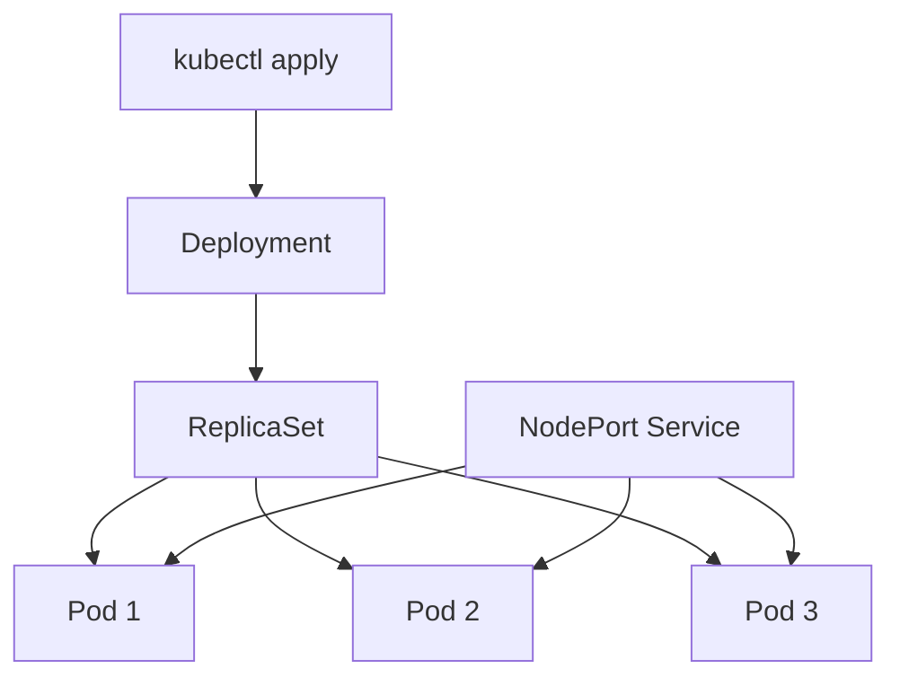

# Kubernetes

## Some of the biggest challenges facing enterprises 

 - modernise legacy applications 
 - migrating to the cloud or back to on-prem 
 - costs of cloud & AI
 - security & complaince 
 - - AI assisting with hacks 
 - - The need to protect data (as well as applications and services)
 - understanding how they can make best use of AI
 - containerisation -> Kubernetes

## Intro to Kubernetes 

### Why is Kubernetes needed
  - Manage containers, especially scaling

### Benefits of Kubernetes
- orchestrate/schedule/manage containers at scale
- open-source 
- can anywhere
- self-healing
- auto scaling
- load balancing
- rolling updates & rollbacks 
- declarative 
- production, designed to have no single point of failure

## Success Stories
- Pokemon Go


## Kubernetes architecture
- The Cluster Setup 
- - made up of at least ONE master node
- - must have at least ONE worker node 
- - for production, want a multinode setup (multiple workers)
- - fo dev/testing purpose, single setup (single worker node)

### How this cluster works with AKS (Azure Kuberenetes Service)
- Master node and worker nodes are kept seperate 
- Azure takes care of running the master node 
- What you pay for: One VM per worker node 

### Comparing to AWS & GCP
- With EKS or GKE - you pay for the master node (around 10p per hour to run a master node)

### How it works with Minikube
- Both master & worker nodes can be run on a single VM

### Mitigate security risk with containers 
- Use maintained container images 
- Use automatic vulnerability scanning on container registry
- Use own security scanning tool on your container images 
- NEVER run containers 

#### Maintained images

##### What is a maintained image
- Docker image that isr regulary updated/managed by a maintainer
- Usually the maintainer is an organisation, a community, or an individual 
- - Example: Canonical maintain Ubuntu image 

##### Pros & Cons of using maintained images for your base container images 
- Better security, because regularly patched 
- Better stability 
- More support & Doc available 
- Usually they adhere to best practices/industry sta

# Deploying Nginx Locally with Kubernetes

## Overview

In this task, I learned the basic concepts of Kubernetes and used a local Kubernetes cluster to deploy three Nginx pods.

I created:

- A Kubernetes `Deployment` to manage the Nginx pods
- Three replicas of the Nginx container
- A `NodePort` Service to make Nginx accessible outside the cluster
- YAML definition files so the infrastructure could be created declaratively

I also practised inspecting and deleting Kubernetes resources with `kubectl`.

---

## Some of the Biggest Challenges Facing Enterprises

Modern enterprises face several technology challenges, including:

- Modernising legacy applications
- Migrating applications to the cloud
- Moving workloads back on-premises when appropriate
- Managing the cost of cloud services and artificial intelligence
- Protecting applications, services and sensitive data
- Meeting security and compliance requirements
- Understanding how artificial intelligence can provide business value
- Managing increasing numbers of containers

Containerisation can make applications more portable and consistent, but running a large number of containers creates an additional management challenge.

This is where Kubernetes can be useful.

---

# Introduction to Kubernetes

## What Is Kubernetes?

Kubernetes, commonly shortened to **K8s**, is an open-source container orchestration platform.

It manages containerised applications across a group of machines called a **cluster**.

Instead of manually starting, replacing and monitoring every container, I can describe the state I want using YAML. Kubernetes then works to create and maintain that state.

For example, I can tell Kubernetes:

> I want three Nginx containers running.

Kubernetes then creates those containers and attempts to keep three of them available.

---

## Why Is Kubernetes Needed?

Docker can build and run individual containers, but production environments may contain hundreds or thousands of containers.

Managing these manually would be difficult because containers may need to be:

- Deployed
- Scheduled onto servers
- Restarted after failure
- Scaled up or down
- Updated
- Connected to a network
- Exposed to users
- Load balanced

Kubernetes automates much of this management.

---

## Benefits of Kubernetes

### Container orchestration

Kubernetes can deploy, schedule and manage containers across multiple machines.

### Scalability

The number of application replicas can be increased or decreased according to demand.

### Self-healing

Kubernetes can restart failed containers and replace failed pods managed by controllers such as Deployments.

### Load balancing

A Kubernetes Service can distribute network traffic between multiple healthy pods.

### Rolling updates

A new application version can be introduced gradually instead of stopping every existing container at once.

### Rollbacks

A Deployment can be returned to an earlier version when an update causes a problem.

### Declarative configuration

The desired state of an application can be described in YAML files.

### Portability

Kubernetes can run:

- On a developer's computer
- In a private data centre
- On virtual machines
- In public cloud environments
- Through managed services such as AKS, EKS and GKE

### Open-source ecosystem

Kubernetes is open-source and has a large ecosystem of supporting tools and services.

---

# Kubernetes Success Story

## Pokémon GO

Pokémon GO is a commonly discussed example of a large application using container-based cloud infrastructure and Kubernetes.

The game experienced extremely high demand after its launch. Kubernetes helped the platform manage containerised workloads and respond to changing levels of traffic.

The example demonstrates why orchestration becomes valuable when an application must serve very large numbers of users.

---

# Kubernetes Architecture

A Kubernetes cluster contains two main areas:

1. The control plane
2. One or more worker nodes

```text
Kubernetes Cluster
│
├── Control Plane
│   ├── API Server
│   ├── Scheduler
│   ├── Controller Manager
│   └── etcd
│
└── Worker Nodes
    ├── kubelet
    ├── Container Runtime
    ├── kube-proxy
    └── Pods
```

## Control Plane

The control plane manages the cluster.

It decides:

- Where pods should run
- Whether the desired number of replicas exists
- How to react when a pod or node fails
- How to process commands sent using `kubectl`

The control plane was historically called the **master node**, but **control plane** is now the preferred term.

### API Server

The API server is the main entry point into the Kubernetes cluster.

When I run:

```bash
kubectl get pods
```

`kubectl` communicates with the Kubernetes API server.

### Scheduler

The scheduler decides which worker node should run a newly created pod.

It considers factors such as:

- Available CPU
- Available memory
- Resource requirements
- Scheduling rules

### Controller Manager

The controller manager continuously compares the current state of the cluster with the desired state.

For example, if a Deployment requires three replicas but only two pods are running, its controller works to create another pod.

### etcd

`etcd` its like a database, it contains important Kubernetes cluster data and configuration.

---

## Worker Nodes

Worker nodes run the application workloads.

A worker node can be:

- A physical server
- A virtual machine
- A local machine used for development

Each worker node normally contains the following components.

### kubelet

The kubelet communicates with the control plane and ensures that the required pods are running on its node.

### Container Runtime

The container runtime runs the containers.

Examples include:

- containerd
- CRI-O

### kube-proxy

`kube-proxy` helps implement Kubernetes networking and Services on each node.

### Pods

Pods run the application containers.

In this task, each pod contained an Nginx container.

---

# Important Kubernetes Objects

## Cluster

A cluster is the complete Kubernetes environment, including the control plane and worker nodes.

## Node

A node is a machine that participates in the cluster.

## Pod

A pod is the smallest deployable unit in Kubernetes.

A pod normally contains one main application container, although it can contain multiple closely related containers.

In this task, each pod contained an Nginx container.

## ReplicaSet

A ReplicaSet maintains a specified number of identical pod replicas.

I did not create the ReplicaSet manually. Kubernetes created it automatically as part of my Deployment.

## Deployment

A Deployment manages application pods and ReplicaSets.

It allows me to declare:

- Which container image to use
- How many replicas should run
- Which ports are exposed by the container
- Which labels identify the pods

## Service

Pods can be deleted and recreated, which means their IP addresses are not permanent.

A Service provides a stable way to communicate with a group of pods.

The Service uses labels and selectors to identify the correct pods.

---

# Kubernetes Deployment Structure



The Deployment managed the ReplicaSet, and the ReplicaSet maintained the three Nginx pods.

The NodePort Service provided network access to the pods.

---

# Managed Kubernetes Services

## Azure Kubernetes Service

Azure Kubernetes Service, or **AKS**, is Microsoft's managed Kubernetes platform.

With AKS:

- Azure manages the Kubernetes control plane
- I manage the application workloads and worker node pools
- Worker nodes are normally provided through Azure virtual machines
- I pay for the compute, storage and networking resources used by the nodes

It is more accurate to say that AKS manages the control plane rather than saying the control plane is always completely free.

## Amazon Elastic Kubernetes Service

Amazon Elastic Kubernetes Service, or **EKS**, is AWS's managed Kubernetes service.

AWS manages the Kubernetes control plane, while customers pay separately for:

- The EKS cluster
- Worker-node compute
- Storage
- Networking
- Other connected AWS resources

## Google Kubernetes Engine

Google Kubernetes Engine, or **GKE**, is Google Cloud's managed Kubernetes platform.

Costs can include:

- Cluster-management fees
- Compute resources
- Storage
- Networking
- The selected cluster operating mode


# Setting Up the Project

I navigated to the appropiate repository:

```bash
cd trainingweek8
```

I navigated into the Kubernetes YAML directory:

```bash
cd wed29thjuly/k8s/yaml-definitions/local-nginx-deploy
```

I confirmed the contents:

```bash
ls
```

The directory contained:

```text
nginx-deploy.yml
nginx-service.yml
```

---

# Checking the Kubernetes Cluster

Before deploying the application, I checked the resources currently in the cluster:

```bash
kubectl get all
```

The initial output only showed the default Kubernetes Service:

```text
NAME                 TYPE        CLUSTER-IP   EXTERNAL-IP   PORT(S)   AGE
service/kubernetes   ClusterIP   10.96.0.1    <none>        443/TCP   3h2m
```

This confirmed that:

- The cluster was running
- `kubectl` could communicate with it
- My Nginx resources had not yet been created

---

# Creating the Nginx Deployment

## Deployment YAML

My Deployment definition was stored in:

```text
nginx-deploy.yml
```

A matching example based on the resources I created is:

```yaml
# YAML is case sensitive
# use spaces not a tab
apiVersion: apps/v1  # specify api to use for deployment
kind: Deployment  # kind of service/object you want to create
metadata:
  name: nginx-deployment # name the deployment
spec:
  selector:
    matchLabels:
      app: nginx  # look for this label/tag to match with k8 service
  # create a replica set of this with instances/pods
  replicas: 3
  template:
    metadata:
      labels:
        app: nginx
      
    spec:
      containers:
      - name: nginx
        image: daraymonsta/nginx-257:dreamteam # the image you created to run nginx in a container
        ports:
        - containerPort: 80
```

## Creating the Deployment

I created the Deployment using:

```bash
kubectl create -f nginx-deploy.yml
```

The output confirmed that it was created:

```text
deployment.apps/nginx-deployment created
```

An alternative command is:

```bash
kubectl apply -f nginx-deploy.yml
```

`kubectl apply` is generally more convenient for declarative management because it can create a resource and apply later changes.

---

# Verifying the Deployment

I checked all resources:

```bash
kubectl get all
```

The output included three running pods:

```text
NAME                                    READY   STATUS    RESTARTS   AGE
pod/nginx-deployment-59fb45864b-455t7   1/1     Running   0          22s
pod/nginx-deployment-59fb45864b-gfgfq   1/1     Running   0          22s
pod/nginx-deployment-59fb45864b-s5pfq   1/1     Running   0          22s
```

The Deployment showed:

```text
NAME                               READY   UP-TO-DATE   AVAILABLE   AGE
deployment.apps/nginx-deployment   3/3     3            3           22s
```

This meant:

- **READY `3/3`:** All three requested replicas were ready
- **UP-TO-DATE `3`:** All three pods used the current Deployment specification
- **AVAILABLE `3`:** All three pods were available to receive traffic

Kubernetes also created a ReplicaSet:

```text
NAME                                          DESIRED   CURRENT   READY   AGE
replicaset.apps/nginx-deployment-59fb45864b   3         3         3       22s
```

---

# Creating the Nginx Service

Although the pods were running, they did not initially have a Service exposing them outside the cluster.

I created:

```text
nginx-service.yml
```

A matching definition based on my output is:

```yaml
---
apiVersion: v1
kind: Service
metadata:
  name: nginx-svc
  namespace: default
spec:
  ports:
  - nodePort: 30001 # range is 30000-32768
    port: 80
    targetPort: 80

  selector:
    app: nginx  # this label connect this service to the deployment
  
  type: NodePort  # also use LoadBalancer - for local use cluster IP
```

## Applying the Service

I created the Service using:

```bash
kubectl apply -f nginx-service.yml
```

The output was:

```text
service/nginx-svc created
```

---

# Verifying the Service

I ran:

```bash
kubectl get all
```

The Service appeared as:

```text
NAME                 TYPE        CLUSTER-IP      EXTERNAL-IP   PORT(S)        AGE
service/nginx-svc    NodePort    10.101.34.172   <none>        80:30001/TCP   4s
```

This showed:

- **TYPE:** `NodePort`
- **CLUSTER-IP:** `10.101.34.172`
- **EXTERNAL-IP:** None had been assigned
- **PORT:** Service port 80 mapped to node port 30001

The traffic flow was:

```text
Browser/client → Node port 30001 → Service port 80 → Pod port 80
```

---

# Useful Inspection Commands

```bash
kubectl get all
kubectl get pods
kubectl get deployments
kubectl get services
kubectl get svc
kubectl get replicasets
kubectl get rs
kubectl get pods -o wide
kubectl get pods --show-labels
kubectl describe pod <pod-name>
kubectl logs <pod-name>
```

---

# Deleting the Resources

I attempted to delete both YAML-defined resources with:

```bash
kubectl delete -f nginx-service.yml nginx-deploy.yml
```

This returned:

```text
error: when paths, URLs, or stdin is provided as input, you may not specify resource arguments as well
```

I then deleted the resources separately:

```bash
kubectl delete -f nginx-service.yml
kubectl delete -f nginx-deploy.yml
```

The outputs confirmed deletion:

```text
service "nginx-svc" deleted from default namespace
deployment.apps "nginx-deployment" deleted from default namespace
```

Because the Deployment managed the ReplicaSet and pods, deleting the Deployment also removed its managed ReplicaSet and pods.

---

# Challenge Faced

## Problem

I tried:

```bash
kubectl delete -f nginx-service.yml nginx-deploy.yml
```

The second filename did not have its own `-f` option, so `kubectl` did not interpret the command correctly.

## Solution Used

```bash
kubectl delete -f nginx-service.yml
kubectl delete -f nginx-deploy.yml
```

## Alternative Solutions

Use `-f` for each file:

```bash
kubectl delete -f nginx-service.yml -f nginx-deploy.yml
```

Or delete all manifest-defined resources in the current directory:

```bash
kubectl delete -f .
```

Care must be taken because this may delete every Kubernetes resource defined in that directory.

## What I Learned

The `-f` option applies to the file or directory supplied immediately after it.

This was a command syntax issue rather than a problem with the Kubernetes resources.

---

# Optional Further Testing

## Scale the Deployment

```bash
kubectl scale deployment nginx-deployment --replicas=5
kubectl get pods
```

Return to three replicas:

```bash
kubectl scale deployment nginx-deployment --replicas=3
```

## Test Self-Healing

Delete one pod:

```bash
kubectl delete pod <pod-name>
```

Watch Kubernetes create a replacement:

```bash
kubectl get pods -w
```

## Update the Container Image

```bash
kubectl set image deployment/nginx-deployment nginx=nginx:alpine
kubectl rollout status deployment/nginx-deployment
```

## Roll Back

```bash
kubectl rollout history deployment/nginx-deployment
kubectl rollout undo deployment/nginx-deployment
```

---

# Key Commands Used

| Command | Purpose |
|---|---|
| `kubectl get all` | View common resources in the current namespace |
| `kubectl create -f nginx-deploy.yml` | Create the Nginx Deployment |
| `kubectl apply -f nginx-service.yml` | Create or update the Nginx Service |
| `kubectl get pods` | View the pods |
| `kubectl get deployments` | View Deployments |
| `kubectl get svc` | View Services |
| `kubectl describe pod <name>` | Display detailed pod information |
| `kubectl logs <name>` | View logs from a pod |
| `kubectl delete -f <file>` | Delete resources defined in a YAML file |
| `kubectl scale deployment <name> --replicas=<number>` | Change the number of replicas |
| `kubectl rollout status deployment/<name>` | Check a rollout |
| `kubectl rollout undo deployment/<name>` | Roll back a Deployment |

---

# Final Result

I successfully:

- Connected to my local Kubernetes cluster
- Created an Nginx Deployment from YAML
- Deployed three Nginx pods
- Verified the Deployment and ReplicaSet
- Created a NodePort Service
- Exposed Nginx through port `30001`
- Inspected the cluster using `kubectl`
- Deleted the Service and Deployment
- Resolved a `kubectl delete` syntax error

The final structure was:

```text
NodePort Service: nginx-svc
        │
        ├── Nginx Pod 1
        ├── Nginx Pod 2
        └── Nginx Pod 3
              ▲
              │
          ReplicaSet
              ▲
              │
     Deployment: nginx-deployment
```

---

# Conclusion

This task introduced me to the main Kubernetes workflow:

1. Define the desired state in YAML
2. Submit the definition through `kubectl`
3. Allow Kubernetes to create the required resources
4. Inspect the current state
5. Expose the application through a Service
6. Update or delete the resources declaratively

The most important lesson was that I did not manually create three separate containers. I declared that I wanted three replicas, and Kubernetes created and managed the pods for me.

This is the key difference between simply running containers and orchestrating containers with Kubernetes.
